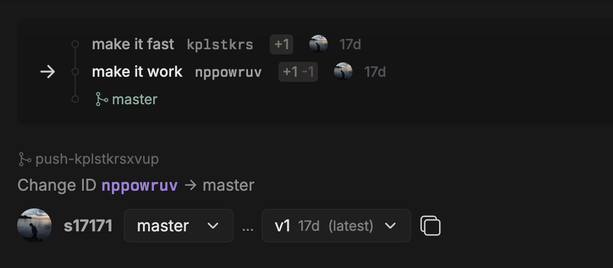

# Changelog

This changelog lists new features and updates in Git ‘n’ Coffee.

## March 1, 2026

* Update file, diff layout and syntax color scheme to improve readability.

## February 22, 2026

* Visual updates to comments and events UI. Similar events are now grouped and de-duplicated.
* Add changes listing to branch pages
* Bug fixes and improvements

## February 17, 2026

* Change ID system inspired by Jujutsu has been introduced. It replaces older patch and patch stack system.
    Read more about [changes](./features/changes.md). New system is more-less a superset of the older system
    and allows much more flexibility when collaborating on changes.
* There are only two types of branches now: regular long lived branches and special branches for change reviews.
    Changes can be submitted using branches named `change/*` or `push-*` (and prefixed variant `*/push-*`)
    `patchstack/*` branches are still supported, but deprecated. All special named branches do the same thing.
* Branches no longer have 1-to-1 mapping to patches (changes). The same change can be updated using any branch. In
    general, branches and their names are less important than the contents of each push.
* Patches built from squashing multiple commits on the branch are no longer supported. `patch/*` is still supported and
    now is the same as `change/*` which creates a change per commit. `patch/*` may be deprecated in the future.
* Code review system has been simplified. Code review now applies to the entire change, not a specific version of it.
    Code review still records the version that was approved however.
* New "ack" review state has been added. It's something in between of not-approved and approved. Precise meaning
    of it is not specified and can be different for each team.
* Sidebar no longer shows each patch (change) separately. Changes in the sidebar are now grouped by their change tree.
    Each group is labeled by the first change in it. In the future, there will be an option to add a title and
    description to it (aka cover letter).
* Change trees are now versioned. Any update to the tree increments its version.
* Comment input boxes use monospace font now
* Various other UI improvements

## January 10, 2026

* Project has been renamed to Git ‘n’ Coffee
* Existing links to gitpatch.com should continue to work and redirect to gitncoffee.com
* Bug fixes and improvements

## December 20, 2025

* Improved website UI on mobile

## December 14, 2025

* Added patch diff feature (aka interdiff). Patch diffs can now be compared directly as a diff between diffs, which
  is similar to Git's [git range-diff](https://git-scm.com/docs/git-range-diff) command.
  * Diagonally crossed-out inserted or deleted lines are the lines that were added to the first diff, but were removed
    from the second diff (reverted).
  * Regular inserted or deleted lines are the new lines that were added to the second diff
  * Dimmed inserted or deleted lines are unchanged lines of context in both diffs
  * Line numbers refer to inserted line positions in each patch
  * Diff stat has four numbers `-X0 +Y0 -X1 +Y1`, where the first pair of X0 and Y0 are lines reverted from the diff,
    the second pair X1 and Y1 are added diff lines. Each pair includes the number of inserted and deleted
    lines from the file respectively.
* Added toggle between `Patch Diff` and `Commit Diff` (regular diff between two commits) for patch comparison.

## October 15, 2025

* Fixed long line wrapping in diffs
* Word diff highlights have been added

## October 4, 2025

* Feedback button is now available in the menu
* Bug fixes and improvements

## September 28, 2025

* Updated UI and color scheme have been released
* Patch page layout have been updated
* Bug fixes and improvements

## July 19, 2025

* Initial public release
