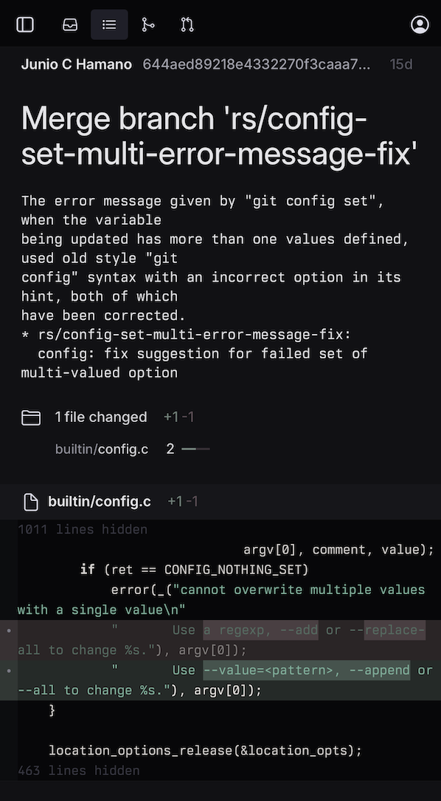
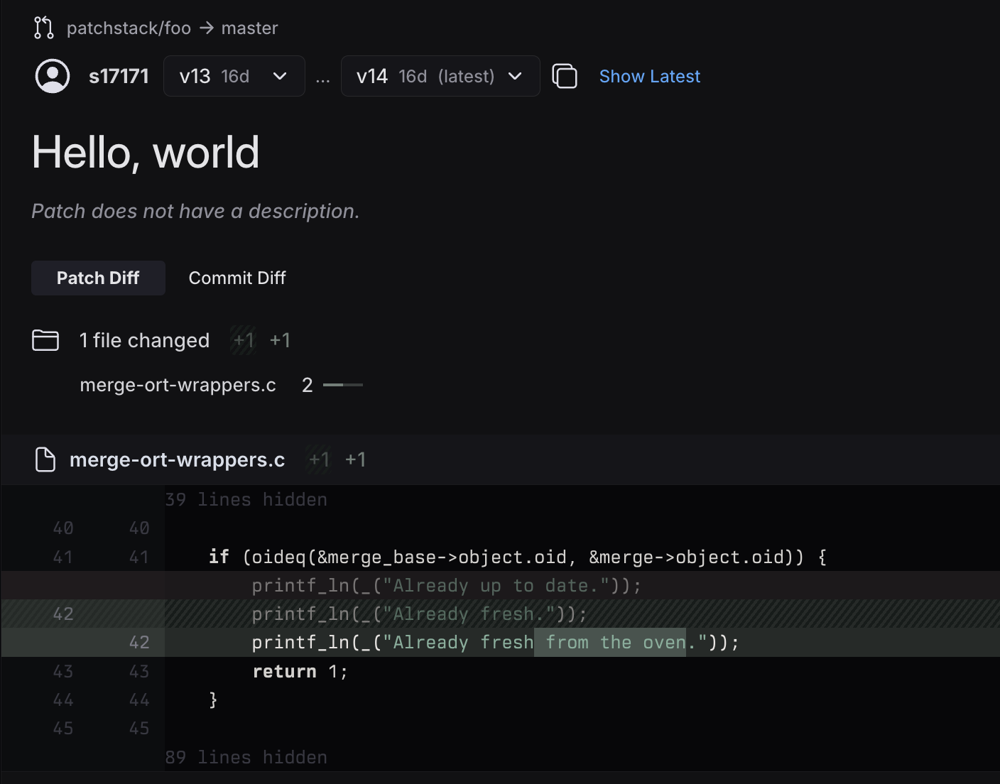
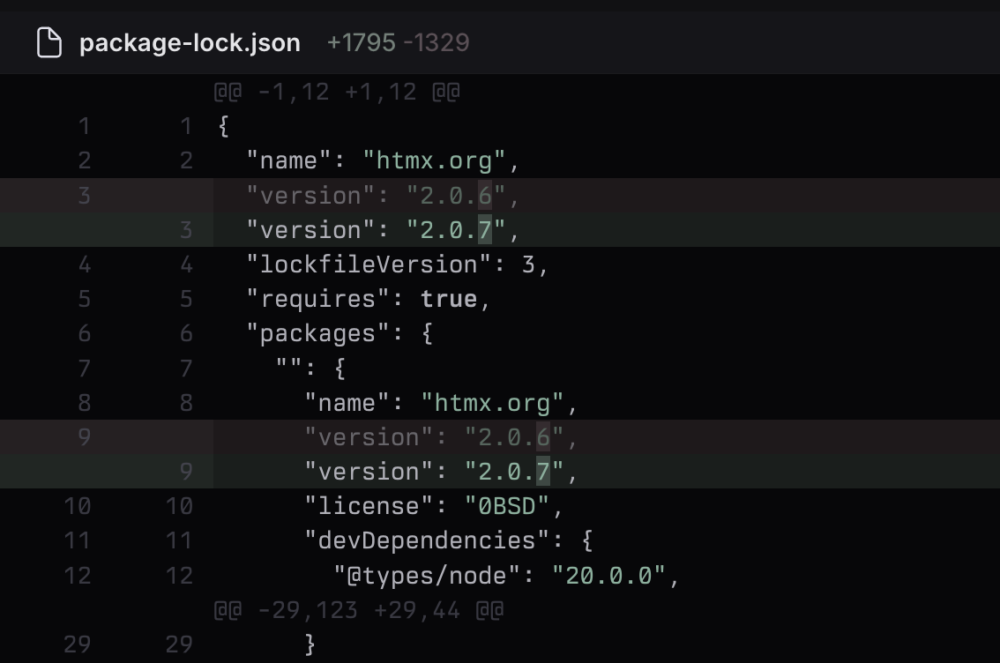

# Changelog

This changelog lists new features and updates in Gitpatch.

## December 20, 2025

* Improved website UI on mobile

## December 14, 2025

* Added patch diff feature (aka interdiff). Patch diffs can now be compared directly as a diff between diffs, which
  is similar to Git's [git range-diff](https://git-scm.com/docs/git-range-diff) command.
  * Diagonally crossed-out inserted or deleted lines are the lines that were added to the first diff, but were removed
    from the second diff (reverted).
  * Regular inserted or deleted lines are the new lines that were added to the second diff
  * Dimmed inserted or deleted lines are unchanged lines of context in both diffs
  * Line numbers refer to inserted line positions in each patch
  * Diff stat has four numbers `-X0 +Y0 -X1 +Y1`, where the first pair of X0 and Y0 are lines reverted from the diff,
    the second pair X1 and Y1 are added diff lines. Each pair includes the number of inserted and deleted
    lines from the file respectively.
* Added toggle between `Patch Diff` and `Commit Diff` (regular diff between two commits) for patch comparison.

## October 15, 2025

* Fixed long line wrapping in diffs
* Word diff highlights have been added

## October 4, 2025

* Feedback button is now available in the menu
* Bug fixes and improvements

## September 28, 2025

* Updated UI and color scheme have been released
* Patch page layout have been updated
* Bug fixes and improvements

## July 19, 2025

* Initial public release
