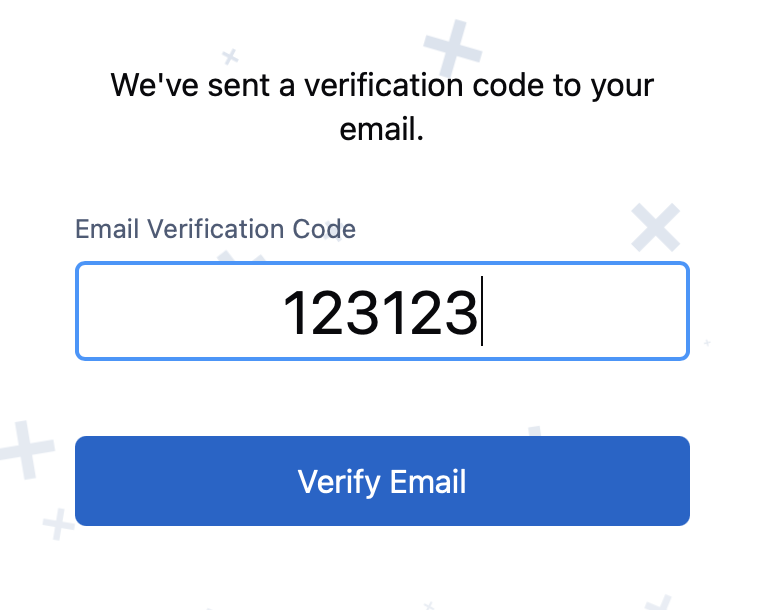
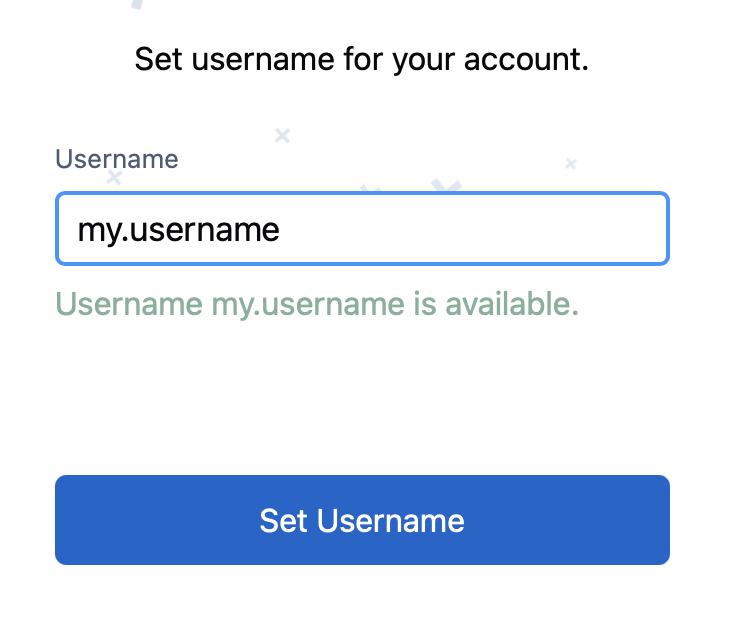
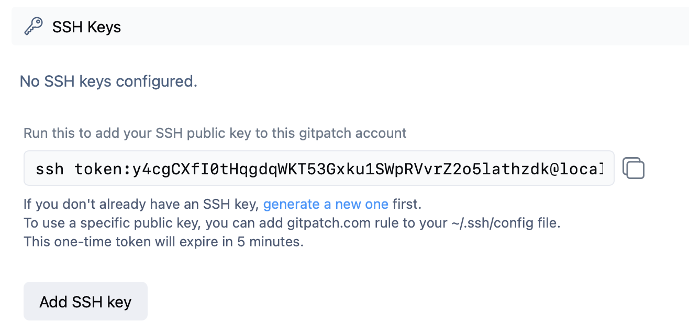

# Get Started with Gitpatch

This guide walks you through the first steps: creating an account, setting up SSH access, and pushing your first repository.

---

## 1. Create Your Gitpatch Account

The sign-up process has three steps:

### Step 1: Fill in Your Email and Password

Visit [gitpatch.com](https://gitpatch.com) and click **Join Gitpatch Beta**. Enter your email address and a secure password.

### Step 2: Verify Your Email

Check your inbox for a short verification code. Enter this code into the form to confirm your email.

</img>

### Step 3: Choose a Username

Pick a public username for your Gitpatch profile.



That's it — your Gitpatch account is ready!

---

## 2. Set Up SSH Access

Gitpatch uses SSH for all git operations. If you've used GitHub or GitLab before, this will feel familiar.

### Generate an SSH Key (If You Don't Have One)

If you don't already have an SSH key, you can create one with:

```bash
ssh-keygen -t ed25519 -C "your_email@example.com"
```

Follow the prompts to save the key (usually in `~/.ssh/id_ed25519`). Then, make sure your SSH agent is running and add the key:

```bash
eval "$(ssh-agent -s)"
ssh-add ~/.ssh/id_ed25519
```

### Add Your SSH Key to Gitpatch

To connect your local Git client to Gitpatch:

1. Visit the [Settings](https://gitpatch.com/settings) page on Gitpatch (after logging in).

2. Click "Add SSH Key" — you'll be given an SSH command to run. This command includes a temporary token generated for your account, and will expire in 5 minutes.

    

3. Run the provided SSH command in your terminal. This will automatically add your SSH key to your Gitpatch account. _Note: For security, newly added SSH keys are disabled by default._

    Example output:

    ```
    ** Added public key to your account: SHA256:<fingerprint> (ssh-ed25519).
    ** This key is not enabled yet. Please verify and enable it on https://gitpatch.com/settings page.
    ```

4. Go back to the [Settings](https://gitpatch.com/settings) page and click "enable" next to your new SSH key to activate it. If you don't see your key, you may need to refresh the page.

Once your key is enabled, you're ready to start pushing code.

---

## 3. Push Your First Repository

There's no need to create a repository on the website - it will automatically be created when you push it.

_Note: `.git` suffix is not required in remote URLs._

Example:

```bash
# Create and initialize a new project
mkdir my-project
cd my-project
git init
touch README.md
git add README.md
git commit -m "Initial commit"

# Add Gitpatch as a remote
git remote add origin git@gitpatch.com:<username>/my-project

# Push to create the repository
git push -u origin main
```

---

## 4. Send Your First Patch

To see how patch branches work, you can create one in your own repository:

1. Create a branch in your project that is prefixed with `patch/`:

    ```bash
    git checkout -b patch/first-patch
    ```

2. Make and commit some changes.

3. Push your branch:

    ```
    git push origin patch/first-patch
    ```

4. After a successful push, you should see a link to your patch.

**Next step:** try creating a patch stack using a branch prefixed with `patchstack/`.
