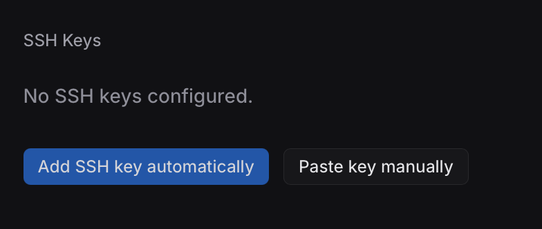

# Get Started with Git ‘n’ Coffee

## 1. Create an account

To start using Git ‘n’ Coffee, sign up at https://gitncoffee.com/signup. The sign up process has three steps:
- Step 1: Fill in your email address and a secure password.
- Step 2: Verify your email. Check your inbox for a short verification code.
- Step 3: Pick a public username for your Git ‘n’ Coffee profile.

---

## 2. Set Up SSH Access

Git ‘n’ Coffee uses SSH for all Git operations. If you've used GitHub or GitLab before, this will feel familiar. If you don't already have an SSH key, [generate one](./generate-ssh.md).

### Add Your SSH Key to Git ‘n’ Coffee

Open the [Settings](https://gitncoffee.com/settings) page on Git ‘n’ Coffee (after logging in).



Git ‘n’ Coffee supports two methods of adding your SSH key:
- Automatic. Git ‘n’ Coffee can automatically add your SSH key when you connect to it with the special username and a one-time token.
	- Click "Add SSH key automatically"
	- Copy and run the provided SSH command in your terminal:
		```
		ssh token:***@gitncoffee.com
		```
	- This works because every time you connect to an SSH server, your SSH client offers public keys to the server. In this case, Git ‘n’ Coffee is going to authorize and add the first provided key to your account. Example command output:
	  ```
		** Added public key to your account: SHA256:<fingerprint> (ssh-ed25519).
	    ** This key is not enabled yet. Please verify and enable it on https://gitncoffee.com/settings page.
	  ```
	- _Note: For security, automatically added SSH keys with this method are disabled by default._ Click "Enable" to enable the key.

- Manual. If you prefer to manually copy-paste the key.
	- Click "Paste Key Manually" and copy-paste your public key into the input box. Public key begins with `ssh-rsa`, `ssh-ed25519` etc.

Once your key is ready, you're ready to start pushing code.

## 3. Push Your First Repository

There's no need to create a repository on the website. It will automatically be created when you push it. _Note: `.git` suffix is not required in remote URLs._

Example:

```bash
# Create and initialize a new project
mkdir my-project
cd my-project
git init
touch README.md
git add README.md
git commit -m "Initial commit"

# Add Git ‘n’ Coffee as a remote
git remote add origin git@gitncoffee.com:<username>/my-project

# Push to create the repository
git push -u origin main
```

## 4. Send Your First Patch

To see how patch branches work, you can create one in your own repository:

1. Create a branch in your project that is prefixed with `patch/`:

    ```bash
    git checkout -b patch/first-patch
    ```

2. Make and commit some changes.

3. Push your branch:

    ```
    git push origin patch/first-patch
    ```

4. After a successful push, you should see a link to your patch.

**Next step:** try creating a patch stack using a branch prefixed with `patchstack/`.
